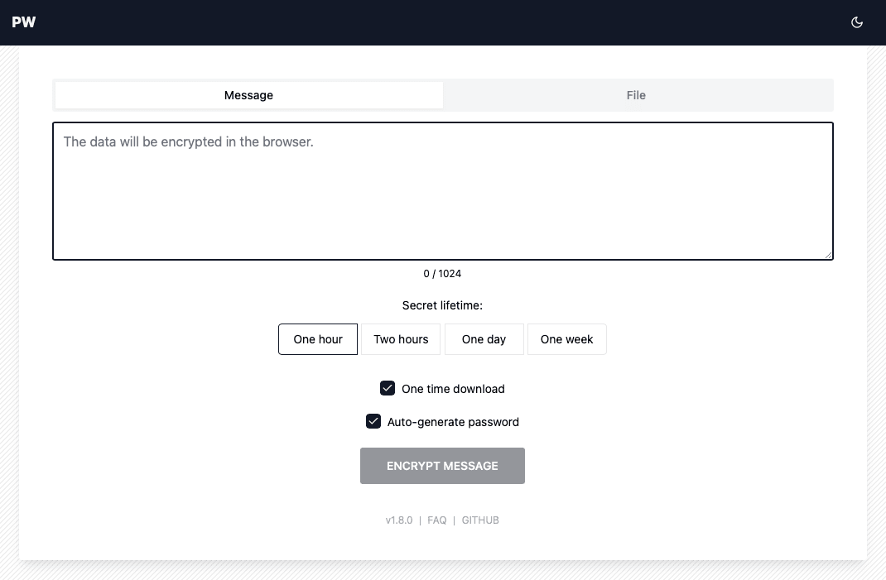
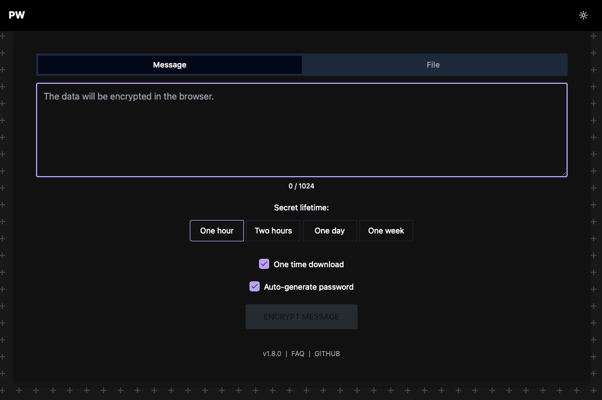

# PW

PW is a project for sharing secrets (any confidential information). All data is encrypted in the browser.





[Demo](https://pw.tinyops.ru)

## Getting started

```shell
docker-compose up -d
```

Then visit http://localhost:8080.

Other options: [install with docker](docs/install/DOCKER.md) or [Kubernetes](docs/install/KUBERNETES.md)

## Features

- Secure: All data is encrypted in the browser ([details](docs/SECURITY.md))
- BLAZING FAST 🌝 (Svelte+Rust)
- Low resources usage:
  
- Localization support ([details](docs/LOCALE.md))
- Themes support

## Docs

- [FAQ](docs/FAQ.md)
- [Installation](docs/install/INSTALL.md)
- [Security](docs/SECURITY.md)
- [Localization](docs/LOCALE.md)
- [API](docs/API.md)
- [How to build](docs/BUILD.md)
- [Architecture](docs/ARCHITECTURE.md)

## Roadmap

1. Improve translations
2. Build static release
3. Add translations
4. Support Windows

## Thanks

- [Nicco](https://github.com/cupcakearmy), author of [cryptgeon](https://github.com/cupcakearmy/cryptgeon)
